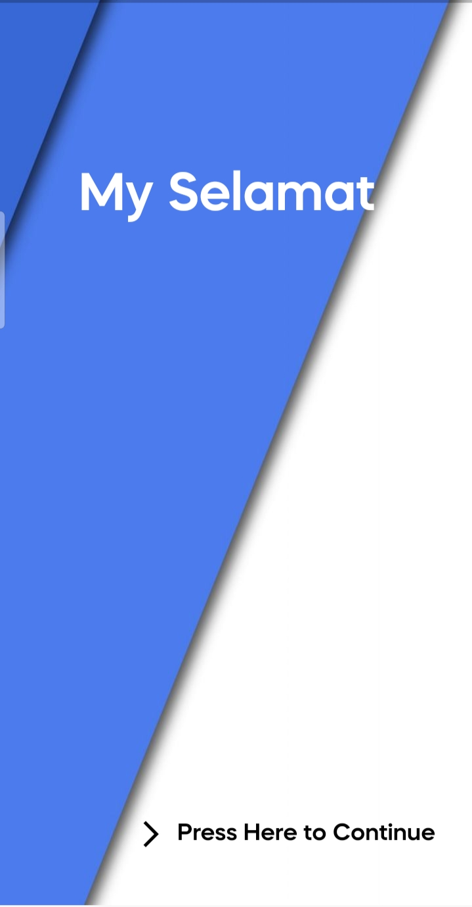
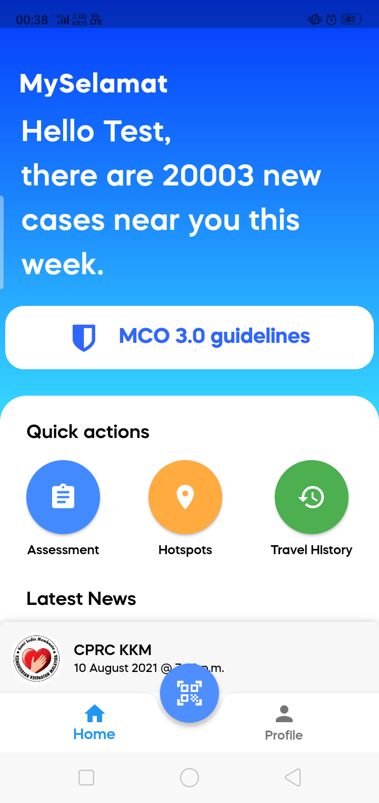
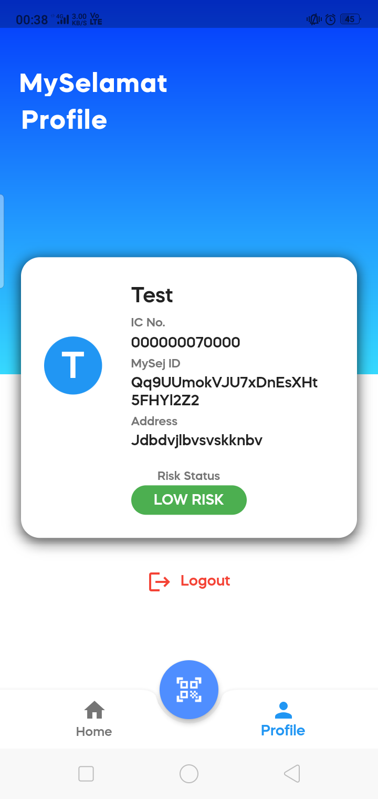
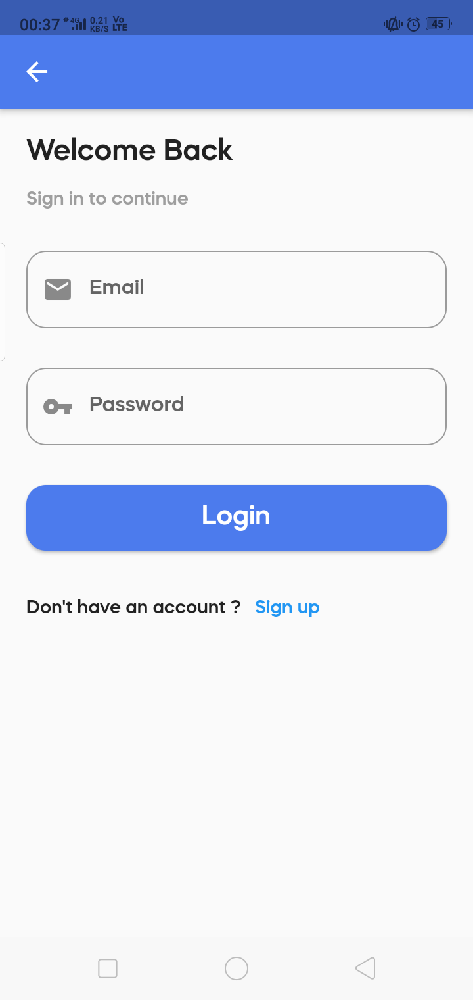
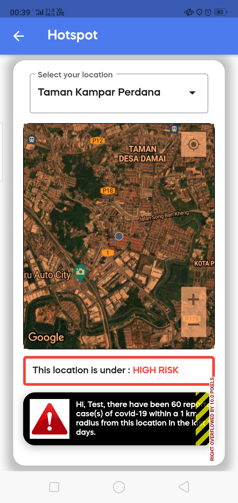
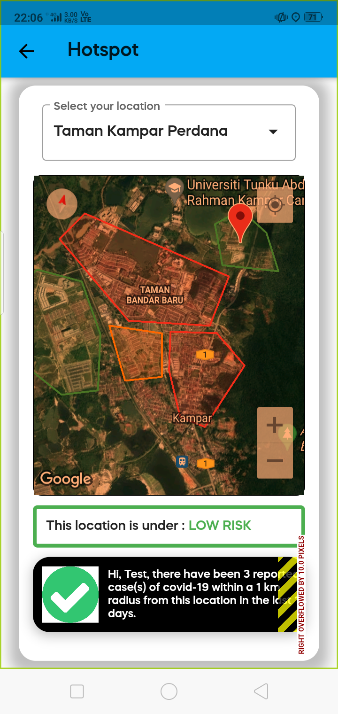
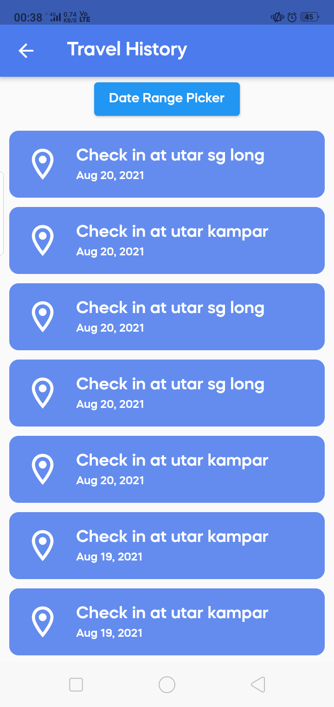
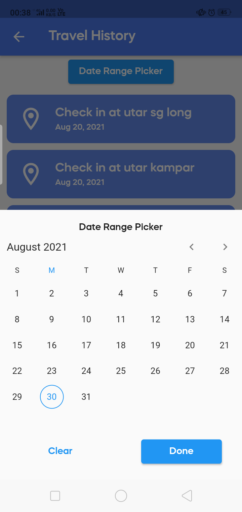
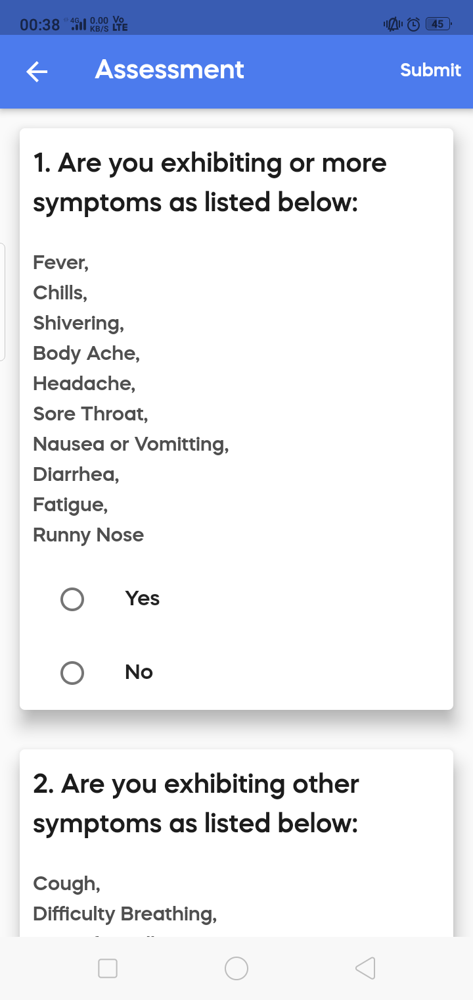

# MySejahtera Redesign
MySejahtera Redesign - UTAR assignment. Developed with Flutter and Firebase.

This is assignment for UCCC2513 Mini Project with design idea reference from [https://github.com/vrevolverrr/mysejahtera](https://github.com/vrevolverrr/mysejahtera)

    
    
    

    
    
    

        
        
        

